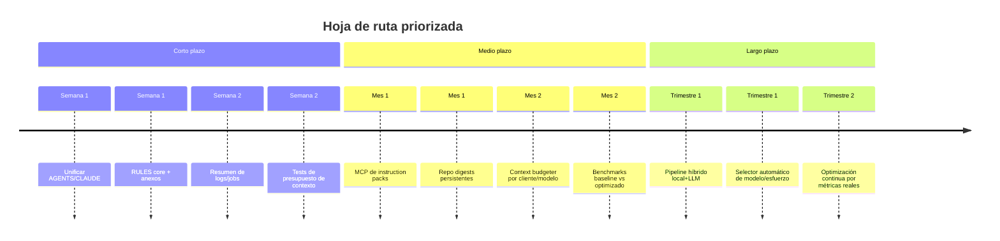

# Informe analítico del repositorio mcp-tools

## Resumen ejecutivo

`mcp-tools` no es un “producto LLM” clásico que llame directamente a APIs de OpenAI o Anthropic desde su backend en Go; es, sobre todo, un **plano de control autoalojado** para instalar, actualizar, desinstalar y sincronizar infraestructura MCP y herramientas auxiliares alrededor de Claude Code, OpenCode, OMP, Codex y Gemini. El repositorio expone un binario Go con CLI, un panel web React Router v7 con SSR opcional, un orquestador que aplica cambios sobre host, Docker y ficheros de configuración de clientes, un registro canónico de 15 componentes gestionados, y una capa documental-operativa muy rica compuesta por `RULES.md`, `AGENTS.md`, `CLAUDE.md`, cuatro `SKILL.md` y un plugin OMP propio con guards y nudges. En la práctica, **la mayor parte del consumo de contexto/tokens no está en el backend Go**, sino en esa **superficie instruccional** y en las **respuestas de MCPs** como Serena, TokenSave, codebase-memory y mem0. citeturn38view0turn16view2turn24view4turn12view0turn19view5turn19view3turn19view4turn18view0turn18view1turn19view0turn19view1

A nivel estructural, el repositorio tiene una separación bastante sana entre entrada CLI (`cmd/mcp-tools/main.go`), comandos Cobra (`internal/cli`), orquestación pura (`internal/orchestrator`), persistencia (`internal/state`), integración de Docker (`internal/docker`), registro MCP por cliente (`internal/mcp`), panel HTTP/SSE (`internal/web`) y catálogo de herramientas (`internal/tools`). El panel web ofrece rutas para dashboard, tools, configure, models, services, plugins, jobs, logs y settings; y el backend publica endpoints `/api/*` para estado, jobs, streaming SSE, sincronización de skills/rules/mcp-config y acciones sobre tools/servicios/modelos/plugins. El repositorio declara además 103 commits en la rama principal y una auditoría reciente reporta `go build`, `go test`, `tsc --noEmit` y pruebas E2E en verde, con 131 tests en 13 paquetes. citeturn38view0turn40view0turn41view0turn39view0turn12view0turn16view0turn21view0

Mi conclusión principal es que `mcp-tools` ya incorpora varias decisiones orientadas indirectamente al ahorro de tokens —por ejemplo, la preferencia por Serena para operaciones simbólicas, el uso de TokenSave como “one-shot context”, el fast path de `get_architecture` en codebase-memory, la limitación del historial SSE por job y el streaming incremental—, pero todavía **sobrecarga demasiado el contexto del cliente** con documentación larga y algo duplicada. La oportunidad más importante no es “optimizar el Go”, sino **refactorizar la capa de instrucciones y exposición MCP**: mover reglas monolíticas a **prompts/resources MCP bajo demanda**, generar variantes compactas por tarea y cliente, introducir un **context budgeter**, añadir **digestos persistentes de repositorio** y resumir logs/contexto antes de enviarlos al modelo. Basándome en el corpus instruccional actual, un rediseño así puede reducir el input recurrente en sesiones reales en el orden de **30% a 70%**, dependiendo de cuánto material se cargue hoy de forma preventiva. Esta recomendación está alineada con las guías oficiales de prompt caching de OpenAI y Anthropic, con la especificación MCP para `prompts` y `resources`, y con la literatura sobre RAG, compresión de prompt y “lost in the middle”. citeturn43view0turn43view1turn43view2turn43view11turn44view2turn43view8turn43view9turn43view10

## Qué es el repositorio y cómo está organizado

El repositorio raíz contiene los directorios `.github/workflows`, `cmd/mcp-tools`, `configs/examples`, `dockers`, `docs`, `internal`, `plugins/mcp-tools-plugin`, `scripts/wrappers`, `skills`, `web` y `webassets`, además de archivos raíz como `.env.example`, `.env.mem0.example`, `.goreleaser.yaml`, `AGENTS.md`, `CLAUDE.md`, `Makefile`, `README.md`, `RULES.md`, `go.mod`, `go.sum` e `install.sh`. La propia portada del repositorio describe `mcp-tools` como “panel de administración web auto-hospedado para tu stack MCP” y sitúa al panel en `http://<host>:8888`. citeturn38view0turn20view3

En términos de empaquetado interno, la división es clara: `cmd/mcp-tools/main.go` es un entrypoint mínimo que delega en `cli.Execute()`, `internal/cli` contiene los subcomandos Cobra, `internal/orchestrator` centraliza la lógica de instalación/configuración/sincronización, `internal/tools` es el punto único de verdad del catálogo gestionado, `internal/mcp` reescribe las configuraciones de clientes MCP, `internal/state` persiste la selección en `state.json`, `internal/web` sirve el panel y la API, `internal/docker` encapsula `docker compose`, y `internal/systemd` gestiona el servicio de sistema. Esa separación está reforzada por comentarios explícitos en el código: el orquestador evita depender de `internal/cli`, el registro de tools es “single source of truth”, y `docker` existe como paquete aparte para no introducir ciclos de importación. citeturn15view0turn15view1turn16view2turn16view3turn24view3turn39view0

El catálogo gestionado por `Registry()` tiene **15 herramientas** y el orden del registro modela implícitamente las dependencias: `nvidia-toolkit`, `qdrant`, `ollama`, `codebase-memory`, `mem0`, `headroom`, `rtk`, `claude-mem`, `codegraph`, `serena`, `tokensave`, `claude`, `codex`, `omp` y `gemini`. Dentro de ese conjunto, sólo **cuatro** aparecen en `internal/mcp/servers.go` como servidores MCP que el sistema registra en clientes: `codebase-memory`, `mem0`, `headroom` y `serena`. `tokensave`, `rtk`, `claude-mem` o `codegraph` son tratados como herramientas de sistema o autorregistro, no como MCPs registrados por `mcp-config`. citeturn16view2turn17view6turn24view4turn20view2

El panel web se construye con una SPA React Router v7 y SSR opcional. `web/app/routes.tsx` importa todas las rutas de forma eager y comenta que el bundle es “small (~800 KB)”, aceptando un único chunk grande a cambio de menor latencia de primer render. Las rutas visibles del panel son `/`, `/tools`, `/configure`, `/models`, `/services`, `/plugins`, `/jobs`, `/logs` y `/settings`, más `shell` y `not-found`; el README documenta esas mismas secciones y su función operativa. En backend, el router HTTP enumera endpoints para estado, tools, jobs SSE, logs Docker por SSE, servicios Docker, modelos Ollama, plugins de workspace y sincronización de skills/rules/mcp-config. citeturn26view0turn12view0turn16view0turn20view1

La pieza más singular del repositorio, desde el punto de vista “agent engineering”, es su capa documental-operativa. `RULES.md` se carga globalmente en clientes como Claude Code, OpenCode y OMP; `AGENTS.md` y `CLAUDE.md` reafirman la política “Serena-first”; cada skill (`codebase-memory`, `mem0`, `serena`, `tokensave`) define triggers, fast paths, workflows y “do not do”; y el plugin `plugins/mcp-tools-plugin` añade guards que fuerzan el routing a MCPs conectados y un nudge post-task para mantenimiento. Eso convierte al repositorio en algo más cercano a una **plataforma de políticas de contexto** que a un simple instalador. citeturn19view5turn19view3turn19view4turn18view0turn18view1turn19view0turn19view1turn19view2turn31view0turn31view1

```mermaid
flowchart LR
    A[CLI mcp-tools] --> B[internal/cli]
    B --> C[internal/orchestrator]
    D[Panel web React Router] --> E[/api/*]
    E --> F[job bus SSE]
    F --> C

    C --> G[internal/tools Registry]
    G --> H[Host binaries]
    G --> I[Docker compose]
    C --> J[internal/mcp]
    J --> K[Claude / OpenCode / OMP / Codex / Gemini]
    C --> L[state.json + .env + .env.mem0]

    M[Cliente LLM] --> N[RULES + AGENTS/CLAUDE + SKILLs + plugin]
    N --> O[MCP servers conectados]
```

La arquitectura anterior resume bien la realidad del proyecto: el backend Go orquesta y persiste; el frontend observa y dispara jobs; el consumo de tokens relevante para LLMs aparece sobre todo **entre el cliente LLM y la capa de instrucciones/MCPs**, no dentro del servidor web. citeturn16view3turn16view0turn24view0turn24view4turn19view5turn18view0turn31view0

### Mapa de estructura por módulos

| Área | Contenido principal | Función |
|---|---|---|
| `cmd/mcp-tools` | `main.go` | Entry point mínimo del binario. citeturn40view0turn15view0 |
| `internal/cli` | comandos `install`, `serve`, `open`, `restart`, `status-web`, `stop`, `update`, etc. | Capa de interfaz usuario/CLI sobre el orquestador. citeturn41view0turn15view1turn15view2 |
| `internal/orchestrator` | `Install`, `RunEnv`, `RunMcpConfig`, particionado por tipo de tool | Núcleo transaccional e idempotente de instalación/configuración. citeturn16view3turn24view0turn28view1turn28view2 |
| `internal/tools` | 15 tools, closures `Install/Upgrade/Uninstall/Status` | Registro canónico de lo gestionado por la plataforma. citeturn16view2turn17view6 |
| `internal/mcp` | `claude.go`, `codex.go`, `gemini.go`, `opencode.go`, `omp.go`, `servers.go` | Reescritura/merge de configuraciones MCP por cliente. citeturn42view0turn25view0turn25view1turn25view2turn25view3turn25view4 |
| `internal/web` | router, handlers API, SSR, job bus, plugins API | Plano HTTP/SSE del panel. citeturn16view0turn16view1turn24view1turn24view2 |
| `web/app` | rutas UI, componentes Radix/Tailwind, `api.ts`, `sse.ts` | Frontend SPA/SSR del panel. citeturn12view0turn12view2turn13view0turn26view1turn26view2 |
| `skills` | `codebase-memory`, `mem0`, `serena`, `tokensave` | Instrucciones largas de uso por MCP/cliente. citeturn14view0turn14view1turn14view2turn14view3 |
| `plugins/mcp-tools-plugin` | guards + nudge post-task + tests | Enforcement en OMP para routing y mantenimiento. citeturn14view4turn29view0turn30view0turn31view0turn31view1 |
| `docs` | advanced, review, audits, compat | Base viva de auditoría y operación. citeturn41view1turn21view0turn21view1turn21view2 |

## Flujos de datos y puntos de consumo de contexto

El flujo operativo principal del producto es lineal y bastante limpio. `mcp-tools install` resuelve `port` y `bind`, detecta si puede usar systemd, instala el unit file y arranca el servidor web; una vez dentro del panel, las acciones POST de `/api/*` crean jobs y delegan en el orquestador; el orquestador regenera `.env` y `.env.mem0`, ejecuta instalaciones/upgrades/uninstalls por tool, persiste `state.json`, y al final sincroniza configuraciones MCP en Claude/OpenCode/OMP/Codex/Gemini. El estado persistente mínimo es `selected`, `versions` y `updated_at`, pero el panel también inspecciona `.env`, `.env.mem0` y Docker Compose. citeturn15view2turn16view3turn16view4turn24view0turn16view5

Lo importante para tu objetivo es distinguir **consumo de bytes/API/UI** frente a **consumo de contexto LLM**. En `mcp-tools`, el segundo aparece en cuatro zonas muy concretas. La primera es la documentación de instrucciones: `RULES.md`, `AGENTS.md`, `CLAUDE.md` y los cuatro `SKILL.md`. La segunda son los **schemas y descripciones** de herramientas MCP expuestas a los clientes. La tercera son los **payloads devueltos por MCPs** como Serena, TokenSave o codebase-memory cuando retornan cuerpos de símbolos, código verbatim, paths de llamada o arquitectura. La cuarta son los **logs/transcripciones** que el usuario puede reenviar al modelo —por ejemplo, jobs SSE o Docker logs—, aunque esos no siempre se inyectan automáticamente. citeturn19view5turn19view3turn19view4turn18view0turn19view0turn19view1turn24view4turn17view2turn24view2

El repositorio ya documenta algunas optimizaciones implícitas de contexto. `AGENTS.md` y `CLAUDE.md` sostienen explícitamente que Serena devuelve “~60% fewer tokens than `rtk grep`” para operaciones de símbolo, y mandan usarlo por defecto para cuerpos, referencias, declaraciones y outline. `skills/tokensave/SKILL.md` define a `tokensave_context` como un reemplazo del “grep+read loop”, prometiendo devolver fuente verbatim más call paths “en una llamada”. `skills/codebase-memory/SKILL.md` también marca un fast path para arquitectura: `get_architecture` primero, sin snippets salvo que el usuario pida detalle. Es decir: el repo ya sabe que el problema existe, pero lo resuelve **a nivel de policy textual**, no con una capa unificada de budget o compresión. citeturn19view3turn19view4turn19view1turn18view0

Hay además varios límites internos muy relevantes. El bus de jobs guarda historial en memoria con `maxHistory = 512` eventos por job; el stream de logs Docker tiene `tail = 200` por defecto, admite entre 10 y 5000 líneas y puede seguir en `-f`; y `RunMcpConfig` intenta sincronizar hasta **cinco clientes** con hasta **cuatro servers MCP** registrados, es decir, un máximo teórico de 20 entradas gestionadas por corrida. El plugin OMP, por su parte, compone **cuatro guards** en orden fijo (`serena-symbol`, `codebase-memory-cross-repo`, `tokensave-explore`, `mem0-search-first`) que se evalúan en cada `tool_call`, más un listener adicional sobre `tool_result` y `agent_end` para el nudge de mantenimiento. citeturn24view2turn17view2turn24view0turn31view0turn31view1turn32view2

### Inventario de componentes que consumen o amplifican contexto

| Componente | Qué consume | Magnitud observable hoy | Comentario |
|---|---|---:|---|
| `RULES.md` | contexto global de routing/políticas | archivo largo, siempre-aplicable en varios clientes | Es el mayor bloque “always on” documentado. citeturn19view5 |
| `CLAUDE.md` + `AGENTS.md` | instrucciones repo-específicas | duplican en gran parte la política Serena-first | Hay duplicación semántica casi literal. citeturn19view3turn19view4 |
| `skills/*.md` | instrucciones por MCP | 4 skills extensas con examples/errores/workflows | Útiles, pero monolíticas para carga preventiva. citeturn18view0turn18view1turn19view0turn19view1 |
| Plugin OMP | razones de bloqueo + nudge oculto | 4 guards por `tool_call` + 1 nudge post-turn | Bajo coste por chequeo, coste alto si bloquea/reinyecta texto. citeturn31view0turn31view1turn31view2turn31view3turn31view4turn31view5 |
| `tokensave_context` | fuente verbatim + caminos de llamada | una llamada puede reemplazar varias lecturas | Ahorra vueltas, pero puede devolver mucho texto. citeturn19view1 |
| Serena (`find_symbol`, etc.) | cuerpos de símbolo y referencias | repo afirma ~60% menos tokens que `rtk grep` | Mejor para operaciones simbólicas acotadas. citeturn19view3turn19view4 |
| codebase-memory | arquitectura, graph, snippets | fast path explícito para arquitectura | Bien diseñado para evitar lectura de código innecesaria. citeturn18view0 |
| mem0 | embeddings + recuperación | usa Qdrant + Ollama embeddings | El coste real va a embeddings/recuperación, no al panel Go. citeturn18view1turn44view0turn44view1 |
| Logs SSE | líneas de jobs y Docker logs | 512 eventos/job; `tail` por defecto 200 | Si se reinyectan al modelo, son una fuente rápida de derroche. citeturn24view2turn17view2 |

### Cuantificación razonable del corpus instruccional

Tomando como corpus mínimo de instrucciones **`RULES.md` + `CLAUDE.md` + `AGENTS.md` + los 4 `SKILL.md` + el nudge `post-task-maintenance.md`**, mi estimación conservadora sitúa la huella potencial actual en el orden de **~14.000 tokens** si un cliente o flujo cargara ese material de forma simultánea; y si se añade `README.md` para sesiones de bootstrap/análisis profundo, la huella sube con facilidad hacia **~17.000–18.000 tokens**. Esa cifra es una **estimación propia** basada en el contenido actual de los archivos y sirve como orden de magnitud, no como metrado protocolario exacto. La intuición cualitativa sí es sólida: `RULES.md` y las skills son suficientemente grandes como para competir de forma material con el contexto útil de una tarea real. citeturn19view5turn19view4turn19view3turn18view0turn18view1turn19view0turn19view1turn32view0turn20view3

El hallazgo más importante aquí es que el repositorio **no sufre tanto de exceso de herramientas como de exceso de instrucción textual distribuida**. La especificación MCP permite que un servidor exponga `prompts` y `resources` además de `tools`; tu stack, sin embargo, está apoyándose hoy sobre archivos Markdown largos que los clientes cargan según convenciones documentales. Ese diseño funciona, pero escala peor en coste de contexto que un diseño donde el cliente sólo pide un prompt compacto **cuando realmente lo necesita**. citeturn44view2turn43view11

## Mejoras concretas para reducir tokens

La mejora con más retorno es **convertir la capa de instrucciones en un sistema bajo demanda**. En lugar de mantener conocimiento operativo repartido entre `RULES.md`, `CLAUDE.md`, `AGENTS.md` y cuatro skills largas, yo introduciría un **source of truth estructurado** y generaría desde ahí: una versión “core always-on” muy corta, variantes por cliente, variantes por idioma, y prompts/resources MCP on-demand para casos concretos como `serena`, `mem0-bugs`, `tokensave-explore`, `architecture-fast-path` o `post-task-maintenance`. La especificación MCP está pensada exactamente para eso: prompts templados y resources de contexto descargables por el cliente. Con ello, el material largo deja de competir en cada turno por el contexto del modelo. citeturn43view11turn44view2turn19view5turn19view3turn19view4turn18view0turn18view1turn19view0turn19view1

La segunda mejora es **deduplicar y estratificar**. `AGENTS.md` y `CLAUDE.md` repiten la política Serena-first con diferencias menores, mientras que `RULES.md` y las skills vuelven a repetir parte del mapping de herramientas y la escalación. Eso sugiere una estructura de tres niveles: un `core policy` de ~400–700 tokens; anexos bajo demanda por MCP; y notas de bugs/operación recuperables sólo cuando la herramienta afectada entra en juego. En términos prácticos, basta con mover el contenido “situacional” fuera del always-on y conservar arriba sólo reglas de alta frecuencia. La guía de OpenAI sobre prompt engineering favorece justamente instrucciones claras y específicas, y las guías de caching de OpenAI y Anthropic recompensan prefijos largos y estables, no prefijos grandes y cambiantes. citeturn19view3turn19view4turn19view5turn43view0turn43view1turn43view4

La tercera mejora es **preservar caching**. Claude y OpenAI ofrecen prompt caching; Claude Code además lo usa automáticamente. Eso vuelve especialmente valioso separar un prefijo estático muy estable del resto del turno: instrucciones core, catálogo de tools estable y configuraciones persistentes al principio; contexto efímero, logs, snippets y objetivos dinámicos al final. Cuanto menos cambie el prefijo y cuanto menos se reescriban instrucciones enteras en cada turno, más probable será aprovechar cache hit y reducir latencia/coste. En OpenAI, además, reducir tokens generados reduce latencia casi proporcionalmente como regla general; en razonamiento, conviene reservar margen de contexto para reasoning/output, no llenarlo con documentación repetida. citeturn43view0turn43view1turn43view2turn43view3turn43view7

La cuarta mejora es **usar resúmenes persistentes y RAG interno para repo/logs/estado**, no Markdown largo ni dumps completos. El propio paper fundacional de RAG justifica combinar memoria paramétrica con memoria no paramétrica recuperable, y los trabajos sobre long context muestran que meter más contexto sin reordenación ni filtrado puede degradar el uso efectivo del mismo, en especial cuando lo relevante queda “perdido en el medio”. Para `mcp-tools`, eso encaja perfecto con digestos compactos de repositorio, resúmenes de jobs y logs por fingerprints de error, y snippets recuperados sólo tras una pregunta concreta. citeturn43view8turn43view10turn18view0turn19view1

La quinta mejora es **recortar tool/result payloads**. El router y la UI ya usan streaming incremental y un historial SSE acotado, pero aún faltan varias optimizaciones semánticas: devolver al modelo summaries primero y artefactos verbatim sólo con opt-in; reducir mensajes de bloqueo de guards a códigos cortos más una recomendación concreta; pre-sumarizar logs antes de permitir `tail=5000`; y ofrecer modos `brief`, `normal`, `verbatim` en nuevas herramientas MCP. En particular, el nudge post-task y las razones de guard son buenos candidatos a versiones más cortas porque hoy son texto largo preescrito orientado a explicar, no a minimizar tokens. citeturn31view1turn31view2turn31view3turn17view2turn24view2

### Refactores recomendados

| Refactor | Qué cambia | Ahorro estimado | Prioridad |
|---|---|---:|---|
| Unificar `AGENTS.md` y `CLAUDE.md` desde una plantilla canónica | elimina duplicación semántica | bajo-medio | Alta |
| Dividir `RULES.md` en `core` + módulos bajo demanda | reduce contexto always-on | alto | Muy alta |
| Exponer `prompts`/`resources` MCP | mueve instrucciones largas fuera del prefijo fijo | muy alto | Muy alta |
| Añadir `repo digest` persistente | evita reexplicar arquitectura en cada sesión | alto | Alta |
| Resumir logs/jobs antes de reenviar al modelo | evita anexos verbatim innecesarios | medio-alto | Alta |
| Budgeter de contexto por cliente/modelo | controla cuánto entra a Claude/Codex | alto | Alta |
| Embedding batching y chunking estable | baja coste de indexación/recuperación | medio | Media |
| Selección de modelo híbrida | tareas ligeras en modelos baratos, complejas en reasoning | medio | Media |

### Pseudocódigo clave

Un buen primer paso es dejar de editar textos largos a mano y pasar a una plantilla única generada:

```ts
type Audience = "claude" | "codex" | "omp" | "generic";
type ModuleKey =
  | "core-routing"
  | "serena-symbols"
  | "tokensave-explore"
  | "codebase-memory-arch"
  | "mem0-known-bugs"
  | "post-task-maintenance";

interface RenderOptions {
  audience: Audience;
  locale: "es" | "en";
  maxTokens: number;
  modules: ModuleKey[];
}

export function renderInstructionPack(opts: RenderOptions): string {
  const base = loadYaml("instructions/core.yaml");
  const selected = opts.modules.map(loadModule);

  const merged = compose(base, selected)
    .dropExamplesIfTokenBudgetExceeded(opts.maxTokens)
    .dropSections(["debug", "fallback-cli"])
    .localize(opts.locale)
    .forAudience(opts.audience);

  return merged.toMarkdown();
}
```

Esta aproximación haría posible generar un `RULES-core.md` corto, un `CLAUDE.md` compacto, un `AGENTS.md` equivalente y, además, prompts MCP bajo demanda desde el mismo material fuente. La ventaja no es sólo ahorro; también reduce drift documental, algo que tus auditorías ya detectaron en varias ocasiones. citeturn21view0

Para caching, conviene tratar el prefijo instruccional como un bloque hasheable independiente del contexto dinámico:

```go
type PromptCacheKey struct {
    Client        string   // claude | codex | omp
    Locale        string   // es | en
    StaticModules []string // core-routing, serena, ...
    ToolManifest  string   // hash(sorted tool schemas)
    RepoDigest    string   // hash of compact repo summary
}

func BuildPrompt(session Session, ask UserAsk) Prompt {
    key := hash(PromptCacheKey{
        Client: session.Client,
        Locale: session.Locale,
        StaticModules: session.StaticModules,
        ToolManifest: session.ToolManifestHash,
        RepoDigest: session.RepoDigestHash,
    })

    staticPrefix := cache.GetOrBuild(key, func() string {
        return renderInstructionPrefix(session)
    })

    dynamicSuffix := buildDynamicContext(ask) // logs, snippets, question
    return Prompt{Prefix: staticPrefix, Suffix: dynamicSuffix}
}
```

Este patrón encaja con las recomendaciones oficiales de prompt caching: un prefijo largo y estable maximiza reúso; un sufijo corto y variable concentra el trabajo nuevo. citeturn43view0turn43view1turn43view2

Para logs y jobs, propongo resumir por fingerprints antes de mostrar verbatim:

```python
def summarize_log_stream(lines, max_items=12):
    errors = cluster_by_signature(lines, kind="error|panic|traceback|WARN")
    timeline = collapse_repeats(lines, max_repeat_window=20)
    suspects = rank_signatures(errors, by=["frequency", "first_seen", "severity"])

    return {
        "summary": [
            f"{sig.count}x {sig.title}" for sig in suspects[:max_items]
        ],
        "first_failure": first_failure_line(lines),
        "services": affected_services(lines),
        "recommended_next_reads": top_relevant_spans(lines, limit=5),
    }
```

La idea no es ocultar el log completo, sino **invertir el orden**: primero resumen y spans relevantes; sólo después verbatim bajo demanda. Esto es coherente con la evidencia de que el contexto largo sin organización posicional empeora el rendimiento. citeturn43view10

Para chunking de repositorios y docs, recomiendo un algoritmo position-aware y jerárquico:

```pseudo
function chunk(document, query=None):
    sections = split_by_headings_or_symbols(document)
    chunks = []

    for section in sections:
        if token_len(section) <= 600:
            chunks.append(section)
        else:
            sub = split_by_paragraph_or_function(section, target=350, overlap=40)
            chunks.extend(sub)

    if query:
        scored = rerank(chunks, query)
        # evitar "lost in the middle":
        # ordena primero chunks con mayor score y coloca un resumen arriba
        return [make_summary(scored[:5])] + interleave_best_first(scored[:12])

    return chunks
```

Ese esquema es más apropiado para `mcp-tools` que un troceado ciego por tamaño, porque aquí los límites naturales existen: rutas, tools, skills, guards, clientes MCP, auditorías y secciones Markdown. citeturn43view10turn43view8

## Nuevos MCPs, skills y agentes propuestos

Tu repositorio ya orquesta MCP servers ajenos, pero todavía **no tiene una capa MCP propia orientada a controlar presupuesto de contexto**. Ahí está, a mi juicio, la siguiente evolución natural del proyecto: pasar de “instalar y sincronizar MCPs” a “instalar, sincronizar y optimizar su uso”. La especificación MCP ya contempla `tools`, `prompts` y `resources`; así que lo más valioso sería añadir nuevos servidores o submódulos que sirvan **prompt packs**, **repo digests**, **log summaries** y **medición de presupuestos** en vez de seguir empujando todo mediante Markdown estático. citeturn44view2turn43view11

### Propuestas prioritarias

| Propuesta | Tipo | Qué hace | Complejidad | Ahorro estimado | Valor usuario |
|---|---|---|---|---:|---:|
| `mcp_tools_instruction_pack` | MCP | expone prompts/resources compactos por tarea/cliente/idioma | Media | Muy alto | Muy alto |
| `mcp_tools_context_budget` | MCP | estima y recorta contexto por turno antes de llamar al LLM | Media-Alta | Muy alto | Muy alto |
| `mcp_tools_repo_digest` | MCP | mantiene resúmenes persistentes por repo, zona y flujo | Media | Alto | Muy alto |
| `mcp_tools_log_digest` | MCP | resume jobs y logs Docker por fingerprint | Baja-Media | Alto | Alto |
| `mcp_tools_evalbench` | MCP/agent | compara escenarios baseline vs optimizados | Media | Indirecto pero crítico | Muy alto |
| `quick-architecture-answer` | Skill | obliga a `get_architecture`/digest antes de snippets | Baja | Medio | Alto |
| `token-budget-debugging` | Skill | flujo corto para depuración orientada a span relevante | Baja | Medio-Alto | Alto |
| `ContextRouterAgent` | Agent | decide entre Serena/TokenSave/codebase-memory/digest según budget | Media | Alto | Muy alto |
| `MaintenanceAgent` | Agent | compacta y automatiza sync/index/memory post-edit | Baja-Media | Medio | Alto |

### Interfaces sugeridas

`mcp_tools_instruction_pack` debería exponer al menos un resource y un prompt:

```json
{
  "name": "get_instruction_pack",
  "description": "Devuelve un paquete instruccional compacto y específico para una tarea.",
  "inputSchema": {
    "type": "object",
    "properties": {
      "task": {
        "type": "string",
        "enum": ["symbol_lookup", "repo_architecture", "cross_repo_search", "memory_save", "post_edit_maintenance"]
      },
      "client": {
        "type": "string",
        "enum": ["claude", "codex", "omp", "generic"]
      },
      "locale": {
        "type": "string",
        "enum": ["es", "en"]
      },
      "max_tokens": { "type": "integer", "minimum": 128, "maximum": 2048 }
    },
    "required": ["task", "client", "locale"]
  }
}
```

Salida sugerida:

```json
{
  "prompt": "texto compacto",
  "modules": ["core-routing", "serena-symbols"],
  "estimated_tokens": 540,
  "fallbacks": ["native-read-single-file"]
}
```

`mcp_tools_context_budget` puede ser todavía más operativo:

```json
{
  "name": "plan_context_budget",
  "description": "Planifica qué contexto incluir y qué excluir para una tarea dada.",
  "inputSchema": {
    "type": "object",
    "properties": {
      "client": { "type": "string" },
      "model_family": { "type": "string" },
      "max_input_tokens": { "type": "integer" },
      "goal": { "type": "string" },
      "candidate_sources": {
        "type": "array",
        "items": {
          "type": "object",
          "properties": {
            "id": { "type": "string" },
            "kind": { "type": "string" },
            "estimated_tokens": { "type": "integer" },
            "priority": { "type": "number" }
          },
          "required": ["id", "kind", "estimated_tokens", "priority"]
        }
      }
    },
    "required": ["client", "model_family", "max_input_tokens", "goal", "candidate_sources"]
  }
}
```

Salida sugerida:

```json
{
  "keep": ["repo_digest", "serena_symbol_body", "last_user_turn"],
  "drop": ["full_rules", "old_job_transcript"],
  "summarize": ["docker_logs_auth"],
  "budget_used": 4820,
  "budget_left": 3172
}
```

`mcp_tools_repo_digest` debería servir tanto a humanos como a agentes:

```json
{
  "name": "build_repo_digest",
  "description": "Genera o actualiza un digest compacto y persistente de un repositorio.",
  "inputSchema": {
    "type": "object",
    "properties": {
      "repo_path": { "type": "string" },
      "focus": {
        "type": "string",
        "enum": ["global", "web", "orchestrator", "mcp", "tools", "token-usage"]
      },
      "refresh": { "type": "boolean" },
      "target_tokens": { "type": "integer", "minimum": 256, "maximum": 4096 }
    },
    "required": ["repo_path", "focus"]
  }
}
```

Salida sugerida:

```json
{
  "digest_md": "# Arquitectura\n...",
  "hotspots": ["internal/tools", "skills", "plugins/mcp-tools-plugin"],
  "artifacts": ["./.mcp-tools/digests/global.md"],
  "estimated_tokens": 950
}
```

`mcp_tools_log_digest` tendría un ROI inmediato porque el propio backend ya trabaja con logs SSE y Compose:

```json
{
  "name": "summarize_runtime_logs",
  "description": "Resume jobs y logs de servicios para minimizar contexto.",
  "inputSchema": {
    "type": "object",
    "properties": {
      "service": { "type": "string" },
      "tail": { "type": "integer", "minimum": 20, "maximum": 5000 },
      "mode": { "type": "string", "enum": ["errors-only", "timeline", "fingerprints"] }
    },
    "required": ["service"]
  }
}
```

Y `mcp_tools_evalbench` debería centrarse en comparativas repetibles:

```json
{
  "name": "run_token_benchmark",
  "description": "Ejecuta un benchmark de tareas y compara baseline vs variante optimizada.",
  "inputSchema": {
    "type": "object",
    "properties": {
      "scenario_set": { "type": "string" },
      "clients": { "type": "array", "items": { "type": "string" } },
      "variants": { "type": "array", "items": { "type": "string" } }
    },
    "required": ["scenario_set", "clients", "variants"]
  }
}
```

La ventaja de formalizar estas piezas como MCPs no es sólo técnica; también hace que “optimizar contexto” deje de ser una convención y pase a ser una capacidad reusable, descubrible y testeable, que es el espíritu del protocolo MCP. citeturn44view2turn43view11turn37search1

## Hoja de ruta y benchmarks

En el corto plazo, yo priorizaría cambios que no exigen rediseñar el ecosistema entero. El primer quick win es **generar `AGENTS.md` y `CLAUDE.md` desde una sola plantilla**. El segundo es **partir `RULES.md` en un núcleo breve y anexos recuperables**. El tercero es **acortar razones de guard y el nudge oculto**, porque incluso siendo “sólo” texto de enforcement, pueden acumularse mucho en sesiones con rebotes. El cuarto es **añadir una prueba de presupuesto de contexto** que falle el CI si el corpus “always-on” cruza un umbral acordado. El quinto es **introducir un summarizer de logs** antes de exponer tails largos a clientes o agentes. Todo esto se puede hacer sin tocar el modelo de instalación ni el registro de tools. citeturn19view5turn19view3turn19view4turn31view1turn17view2turn24view2

En el medio plazo, movería el repositorio hacia **MCP prompts/resources + repo digests persistentes + context budgeter**. Ahí es donde de verdad cambia la economía del sistema. El coste principal será diseñar bien la taxonomía de tareas y compatibilidad entre clientes, pero el beneficio es fuerte: menos documentación preventiva, más contexto activo, más cache hits y menos drift. También encaja mejor con Codex, cuyo ecosistema MCP ya contempla conexión directa a servers y configuración compartida por CLI/IDE. citeturn43view5turn43view6turn44view2turn43view11

En el largo plazo, apostaría por una capa **híbrida local + LLM**: parsing local y resúmenes deterministas para estado, logs y árboles de repo; embeddings y recuperación sólo donde aporten algo; y reasoning models reservados para reescrituras complejas, auditorías o síntesis difíciles. OpenAI recomienda razonamiento en Responses API y señala que hay que reservar espacio para reasoning tokens; también insiste en que generar menos tokens reduce latencia. Eso vuelve razonable un pipeline escalonado: primero heurística local, luego recover/retrieve, y sólo después modelo caro. citeturn43view7turn43view3turn44view1



### Benchmarks y pruebas que añadiría

| Prueba | Qué mide | Objetivo |
|---|---|---|
| `instruction_budget_test` | tokens estimados del corpus always-on | impedir regresiones documentales |
| `guard_message_budget_test` | longitud máxima de razones de bloqueo | evitar mensajes excesivos |
| `repo_digest_fidelity_test` | cobertura del digest vs verdad del repo | no sacrificar precisión |
| `log_digest_regression_test` | que el resumen preserve first failure y fingerprints | no ocultar diagnóstico útil |
| `context_budget_planner_test` | selección estable de fuentes bajo presupuesto | reproducibilidad |
| `task_suite_ab` | prompt_tokens, completion_tokens, latencia y success rate baseline vs candidato | cuantificar ahorro real |
| `client_matrix_e2e` | Claude / Codex / OMP / OpenCode | compatibilidad cruzada |

Yo definiría una suite de escenarios representativos, por ejemplo: “explica arquitectura”, “encuentra símbolo y referencias”, “depura fallo de servicio”, “actualiza documentación”, “recuerda decisión previa”. Para cada escenario ejecutaría al menos dos variantes: **baseline actual** y **variante optimizada**. Las métricas mínimas serían `input_tokens`, `output_tokens`, `tool_calls`, `blocked_calls`, `cache_hit_rate`, `latency_ms`, `success_rate` y `human_score`. Si la variante optimizada ahorra tokens pero empeora fiabilidad, no pasa de fase. Ése debe ser el criterio. Las guías de producción de OpenAI y las de prompt caching/latency optimization justifican plenamente este enfoque de medición continua. citeturn34search4turn43view0turn43view3

## Riesgos, trade-offs y métricas

El principal riesgo de este rediseño es el **subcontexto**: comprimir o modularizar demasiado puede ocultar bugs conocidos, excepciones operativas o detalles de tooling que hoy están explícitos en `RULES.md` y skills. En tu caso esto es especialmente sensible con mem0, porque el repositorio documenta bugs upstream concretos y workarounds actuales; si esa información desaparece del prefijo y el recover falla, el agente puede volver a cometer errores evitables. La mitigación correcta no es “dejar todo largo”, sino asegurar prompts/resources recuperables y tests de cobertura de policies críticas. citeturn19view5turn19view6

Otro riesgo es el **coste de complejidad**. Añadir nuevos MCPs, digests, budgeters y benchmarks hace al sistema más potente, pero también más difícil de operar y de explicar. Además, la especificación MCP soporta prompts y resources, pero el grado de soporte real por cliente puede variar; por eso conviene mantener durante un tiempo un camino dual: documentación estática corta + MCP prompts bajo demanda. La propia especificación destaca negociación de capacidades, logging, cancelación y consideraciones de seguridad; eso sugiere diseñar estas piezas como opt-in progresivo y no como sustitución instantánea. citeturn44view2turn43view11

El tercer riesgo es la **deriva de cache**. El prompt caching sólo ayuda de verdad si el prefijo permanece estable. Si se generan variantes demasiado personalizadas o se mezclan logs/contexto dinámico en el mismo bloque, la cache se invalida y el beneficio se evapora. Por eso recomiendo separar estrictamente: prefijo canónico y estable; contexto vivo al final. Tanto OpenAI como Anthropic enfatizan justamente ese patrón. citeturn43view0turn43view1turn43view2

El cuarto riesgo es la **posición y orden del contexto**. La investigación sobre “lost in the middle” muestra que no basta con meter más contexto: dónde colocas lo relevante importa. Si introducís repo digests, log digests o anexos de bugs, conviene poner arriba un resumen ejecutivo muy pequeño y después los spans relevantes; no sepultar la clave entre bloques medianos. Esto afecta especialmente a depuración, donde una sola línea de first failure vale más que cien líneas de tail. citeturn43view10

### Métricas de monitorización

| Métrica | Por qué importa |
|---|---|
| `always_on_instruction_tokens_est` | vigila el tamaño del prefijo fijo |
| `avg_prompt_tokens_per_task` | coste real por tipo de trabajo |
| `cache_hit_rate` | valida que la estrategia de prefijo estable funciona |
| `avg_tool_calls_per_turn` | detecta loops de búsqueda/lectura innecesarios |
| `guard_block_rate` | mide fricción del plugin y oportunidades de mejor routing |
| `avg_log_tokens_forwarded` | controla derroche en depuración |
| `repo_digest_hit_rate` | indica si los nuevos digestos sustituyen lecturas largas |
| `embedding_tokens_per_index_job` | coste de indexación/recuperación |
| `duplicate_mem0_write_rate` | evalúa calidad del flujo search-before-add |
| `task_success_rate` | asegura que el ahorro de tokens no baja calidad |

## Referencias primarias y buenas prácticas

Las mejores prácticas que usaría para guiar el refactor salen de tres grupos de fuentes.

Primero, las **fuentes primarias del propio repositorio**: el registro de tools, la sincronización MCP, el router HTTP, los skills y reglas, y las auditorías recientes. Son las que permiten afirmar con precisión dónde están hoy los cuellos de botella de contexto, qué partes ya están optimizadas informalmente y qué drift documental se ha corregido o sigue siendo probable. Entre ellas, las más importantes son `README.md`, `RULES.md`, `AGENTS.md`, `CLAUDE.md`, los cuatro `SKILL.md`, `internal/tools/registry.go`, `internal/mcp/servers.go`, `internal/orchestrator/sync.go`, `internal/web/router.go`, `internal/web/job.go` y la auditoría del 2026-07-13. citeturn20view1turn20view3turn19view5turn19view3turn19view4turn18view0turn18view1turn19view0turn19view1turn16view2turn24view4turn24view0turn16view0turn24view2turn21view0

Segundo, la **documentación oficial de plataforma**. Para Claude y Claude Code: prompt caching automático y su impacto sobre coste y velocidad. Para OpenAI: prompt caching, latency optimization, prompt engineering, reasoning models, embeddings y el uso de MCP con Codex. Estas fuentes sustentan las recomendaciones de separar prefijos estáticos, bajar la verborrea, usar Responses/reasoning de forma medida, batchear embeddings y aprovechar MCP como interfaz formal para tools/context/prompts. citeturn43view0turn43view1turn43view2turn43view3turn43view4turn43view5turn43view6turn43view7turn44view0turn44view1

Tercero, la **literatura técnica**. RAG justifica mover conocimiento recuperable fuera del prompt fijo; LongLLMLingua apoya compresión de prompts en contextos largos; y “Lost in the Middle” explica por qué meter documentos largos “tal cual” no sólo cuesta más, sino que puede empeorar el rendimiento efectivo del modelo. Para `mcp-tools`, estos trabajos no son teoría lejana: justifican directamente repo digests, log digests, chunking jerárquico, reranking y delivery posicional de evidencia. citeturn43view8turn43view9turn43view10

Mi recomendación final, condensada, sería esta: **convierte `mcp-tools` de un instalador/panel con mucha política documental en un optimizador activo del contexto de agentes**. Ya tiene las piezas para hacerlo: registry, sync de clientes, skills, plugin, jobs y panel. Lo que falta es que la economía de tokens deje de vivir “en el Markdown” y pase a vivir “en capacidades MCP medibles, recuperables y cacheables”. Si haces sólo una cosa, que sea ésta. citeturn44view2turn43view11turn43view0turn43view1